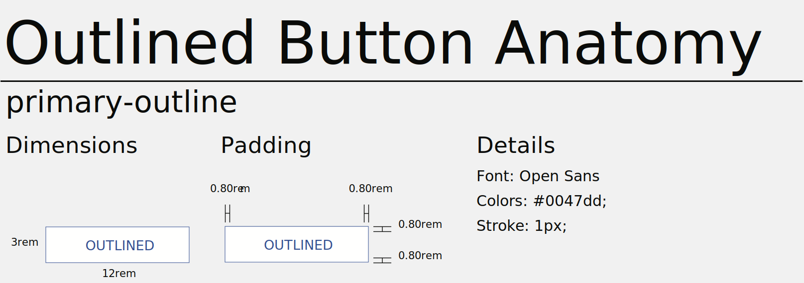
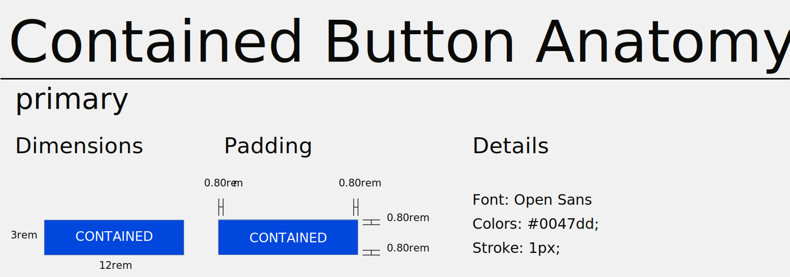

# Button Types


## Overview

Buttons are used to initialize action, either to go on another page (i.e. call to action on a banner), to act on an item (i.e. save, add or login) or to navigate inside an app (i.e. next or previous).

## Text button (Low emphasis)

Text buttons are typically used for less important actions, including those located in dialogs and cards. In cards, text buttons help maintain an emphasis on card content.


### Example

=== "Preview"
    [Link](https://skeletonic.io){ .button .link }

=== "Markup"
    ```sh
    <button type="button" class="link">Link</button>
    ```

## Outlined Button (Medium emphasis)



Outlined buttons are used for more emphasis than text buttons due to the stroke. They contain actions that are important, but aren’t the primary action in an app.

### Example

=== "Preview"
    [Outlined](https://skeletonic.io){ .button .primary-outline }

=== "Markup"
    ```sh
    <button type="button" class="primary-outline">Outlined</button>
    ```

## Contained button (High emphasis)

Contained buttons have more emphasis, as they use a color fill and shadow. They contain actions that are primary to your app.



### Example

=== "Preview"
    [Contained](https://skeletonic.io){ .button .primary }

=== "Markup"
    ```sh
    <button type="button" class="primary">Contained</button>
    ```
