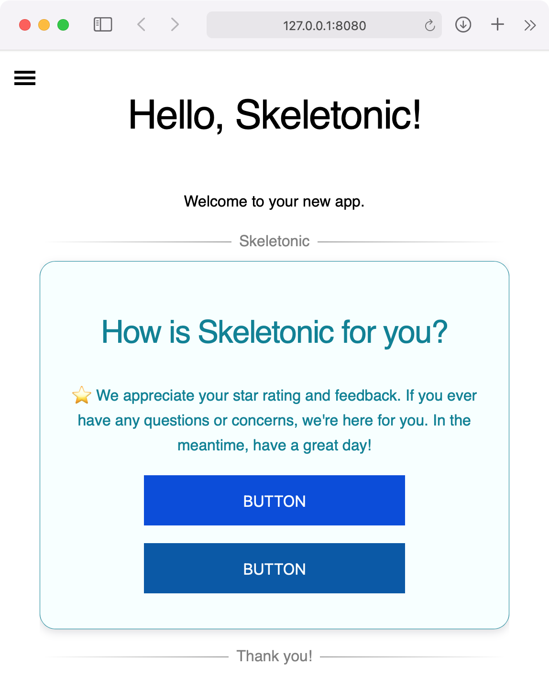

# Hello Skeletonic

Getting started with the Skeletonic Stylus Library is almost effortless.

This guide will take you step by step through creating a simple web page, building it, and running it locally on a web server.

## Prerequisites

### Download and install Node.js

!!! note
    The prerequisites listed below are the minimum requirements for completing this first app demo.

If you haven't installed Node yet, download the latest stable release of [Node.js](https://nodejs.org/en/download/).

## Set Up Your First Website

### Create Your Site

The first step is to create a new folder for your project and change into the newly created folder. Open up your terminal and enter the following:

```sh
mkdir hello && cd hello 
```

Once the command finishes, let's initialize our package.json file:

```sh
npm init 
```

Now let's install skeletonic-stylus and list skeletonic-stylus as a dev dependency in our package.json

```sh
npm install --save-dev skeletonic-stylus
```

NPM will automatically begin downloading the Skeletonic Stylus Library, the library is lightweight, so even if you are on a slow internet connection it shouldn't take too much time to download.

Let’s continue by creating an empty HTML file and a folder to store the Skeletonic CSS files. To do so, in Terminal run:

```sh
touch index.html && mkdir css
```

We can now copy all the Skeletonic's CSS files into our newly created folder

```sh
cp node_modules/skeletonic-stylus/css/*.css css/ 
```

To get started right away, you can use this HTML starter template. Just copy/paste this code in the index.html file:

```html
<!DOCTYPE html>
<html lang="en" itemscope="" itemtype="http://schema.org/WebPage">

<head>
  <meta charset="UTF-8" />
  <meta name="viewport" content="width=device-width, initial-scale=1.0" />
  <title>Hello, Skeletonic!</title>
  <link href="css/skeletonic.min.css" rel="stylesheet">
  <link href="css/skeletonic-fonts.min.css" rel="stylesheet">
  <link href="css/skeletonic-colors.min.css" rel="stylesheet">
  <link href="css/skeletonic-animations.min.css" rel="stylesheet">
</head>

<body>
  <div id="navigation">
    <input type="checkbox" class="hamburger" id="hamburger" name="hamburger"> 
    <label title="Open the menu" for="hamburger" class="hamburger-toggle cl-white" aria-hidden="true"> 
      <span class="hidden" aria-hidden="true">Main menu</span>
      <span class="spinner diagonal part-1"></span>
      <span class="spinner horizontal"></span>
      <span class="spinner diagonal part-2"></span> 
    </label>
    <nav id="sidebar">
      <ul class="nav">
        <li><a href="/">Home</a></li>
      </ul>
    </nav>
  </div>
  <main class="container center text-center">
    <h1>Hello, Skeletonic!</h1>
    <p>Welcome to your new app.</p>
    <hr class="hr-text" data-content="Skeletonic">
    <div class="card info padding-1">
      <div class="card-content">
        <h2>How is Skeletonic for you?</h2>
        <p>⭐ We appreciate your star rating and feedback.  If you ever have any questions or concerns, we're here for you. In the meantime, have a great day!</p>
        <button class="primary center">Button</button>
        <button class="secondary center">Button</button>
      </div>
    </div>
    <hr class="hr-text" data-content="Thank you!">
  </main>  
</body>

</html>
```

## Publish Your Site

### Initial Setup

Install the http-server package from npm

Open a command prompt / command line window and enter the following:

```html
npm install --save-dev http-server
```

and put in your package.json:

```html
 "scripts": {
  "start": "http-server .",
   "test": "echo \"Error: no test specified\" && exit 1"
 }
```

### Deploy Your Site

In the terminal window, copy and paste the following command to run the app in a local web server from our directory:

```html
npm start
```

This will build and start the app. Once running you should see the following in your console:

```sh
Starting up http-server, serving .
Available on:
  http://127.0.0.1:8080
  http://192.168.86.28:8080
Hit CTRL-C to stop the server
```

## Preview Your Site

Open your web browser, and visit <a href="http://127.0.0.1:8080" target="_blank">[http://127.0.0.1:8080](http://127.0.0.1:8080)</a>

You should see the following page:



Congratulations on creating, building, and running your first Skeletonic app! 🎉
