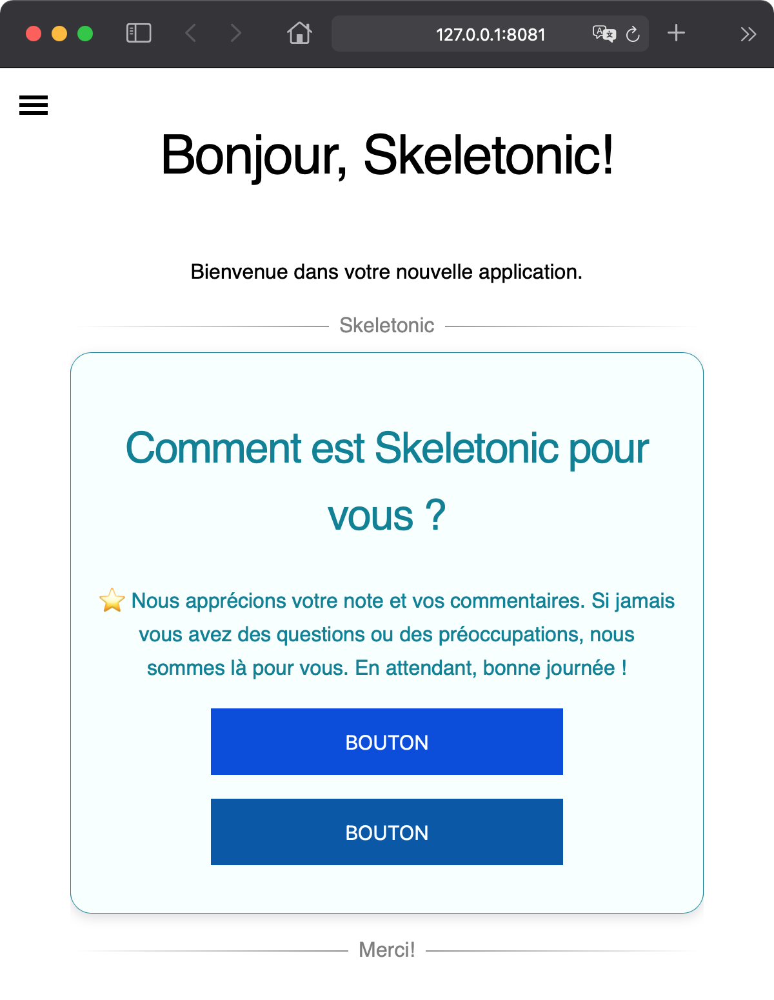

# Bonjour Skeletonic


Démarrer avec la bibliothèque Stylus Skeletonic et ce, presque sans effort. Ce guide vous aidera pas à pas dans la conception d'une page web simple, sa construction et son exécution locale sur un serveur Web.

## Conditions préalables

### Télécharger et installer Node.js

!!! remarque
    Certaines conditions préalables répertoriées ci-dessous sont nécessaires pour accomplir cette application démo.

Si vous n'avez pas encore installé Node, téléchargez la dernière version stable de [Node.js](https://nodejs.org/en/download/).

## Configurez votre premier site Web

### Créez votre site

La première étape consiste à créer un nouveau dossier pour votre projet et à changer dans le nouveau dossier créé. Ouvrez votre terminal et entrez ce qui suit :

```sh
mkdir bonjour && cd bonjour
```

Une fois la commande terminée, initialisons notre fichier package.json :

```sh
npm init 
```

Installons maintenant la bibliothèque Stylus Skeletonic et répertorions la en tant que dépendance de développement dans notre fichier "package.json"

```sh
npm install --save-dev skeletonic-stylus
```

NPM commencera automatiquement à télécharger la bibliothèque Stylus Skeletonic, la bibliothèque est légère, donc même si vous utilisez une connexion Internet lente, le téléchargement ne devrait pas prendre trop de temps.

Continuons en créant un fichier HTML vide et un dossier pour stocker les fichiers CSS Skeletonic. Pour ce faire, allez dans le répertoire où vous conservez votre code source et exécutez cettecommande comme suit :

```sh
touch index.html && mkdir css
```

Nous pouvons maintenant copier tous les fichiers CSS de Skeletonic dans notre dossier nouvellement créé :

```sh
cp node_modules/skeletonic-stylus/css/*.css css/ 
```

Pour commencer tout de suite, vous pouvez utiliser le modèle de démarrage HTML. Copiez/collez simplement ce code dans le fichier index.html :

```html
<!DOCTYPE html>
<html lang="en" itemscope="" itemtype="http://schema.org/WebPage">

<head>
  <meta charset="UTF-8" />
  <meta name="viewport" content="width=device-width, initial-scale=1.0" />
  <title>Bonjour, Skeletonic!</title>
  <link href="css/skeletonic.min.css" rel="stylesheet">
  <link href="css/skeletonic-fonts.min.css" rel="stylesheet">
  <link href="css/skeletonic-colors.min.css" rel="stylesheet">
  <link href="css/skeletonic-animations.min.css" rel="stylesheet">
</head>

<body>
  <div id="navigation">
    <input type="checkbox" class="hamburger" id="hamburger" name="hamburger"> 
    <label title="Open the menu" for="hamburger" class="hamburger-toggle cl-white" aria-hidden="true"> 
      <span class="hidden" aria-hidden="true">Menu</span>
      <span class="spinner diagonal part-1"></span>
      <span class="spinner horizontal"></span>
      <span class="spinner diagonal part-2"></span> 
    </label>
    <nav id="sidebar">
      <ul class="nav">
        <li><a href="/">Accueil</a></li>
      </ul>
    </nav>
  </div>
  <main class="container center text-center">
    <h1>Bonjour, Skeletonic!</h1>
    <p>Bienvenue dans votre nouvelle application.</p>
    <hr class="hr-text" data-content="Skeletonic">
    <div class="card info padding-1">
      <div class="card-content">
        <h2>Comment est Skeletonic pour vous ?</h2>
        <p>⭐ Nous apprécions votre note et vos commentaires. Si jamais vous avez des questions ou des préoccupations, nous sommes là pour vous. En attendant, bonne journée !</p>
        <button class="primary center">Bouton</button>
        <button class="secondary center">Bouton</button>
      </div>
    </div>
    <hr class="hr-text" data-content="Merci!">
  </main>  
</body>

</html>
```

## Publiez votre site

### Configuration initiale

Installer le paquet http-server à partir de npm

Ouvrer une fenêtre d'invite de commande/ligne de commande et entrez ce qui suit :

```html
npm install --save-dev http-server
```

et mettez ces lignes dans votre package.json :

```html
 "scripts": {
  "start": "http-server .",
   "test": "echo \"Error: no test specified\" && exit 1"
 }
```

### Déployez votre site

Dans la fenêtre du terminal, copiez et collez la commande suivante pour exécuter l'application sur un serveur Web local à partir de notre répertoire :

```html
npm start
```

Cela va créer et démarrer l'application. Une fois exécuté, vous devriez voir ce qui suit dans votre console :

```sh
Starting up http-server, serving .
Available on:
  http://127.0.0.1:8080
  http://192.168.86.28:8080
Hit CTRL-C to stop the server
```

## Aperçu de votre site

Ouvrez votre navigateur Web et visitez <a href="http://127.0.0.1:8080" target="_blank">[http://127.0.0.1:8080](http://127.0.0.1:8080)</a>

Vous devriez voir la page suivante :



Félicitations pour la création, la construction et l'exécution de votre première application Skeletonic ! 🎉
