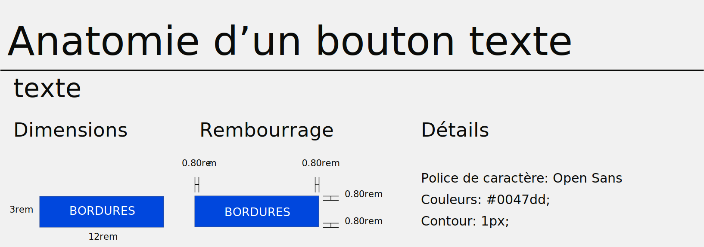
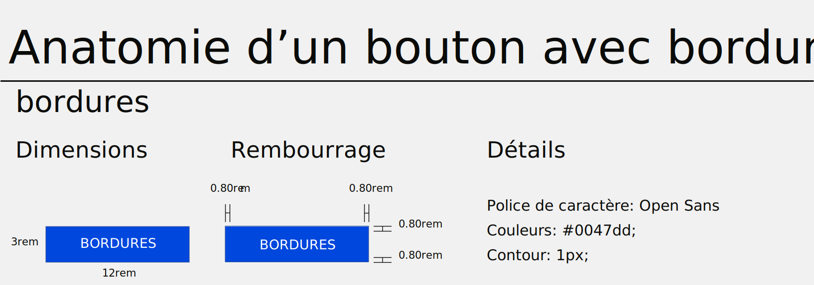
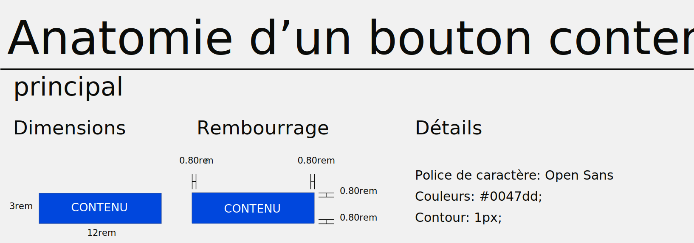

# Types de boutons


Les boutons sont utilisés pour initialiser l'action, soit pour aller sur une autre page, pour agir sur un élément ou pour naviguer dans une application.

## Bouton de texte (Faible emphase)



Les boutons de texte sont généralement utilisés pour des actions moins importantes, y compris celles situées dans les dialogues et les cartes. Dans les cartes, les boutons de texte aident à maintenir l'accent sur le contenu de la carte.

=== "Aperçu"
    [Texte](https://skeletonic.io){ .button .link }

=== "Code"
    ```sh
    <button type="button" class="link">Texte</button>
    ```

## Bouton avec bordures (Accent moyen)



Les boutons avec bordures sont utilisés pour plus d'emphase que les boutons de texte. Ils contiennent des actions importantes, mais qui ne sont pas l'action principale d'une application.

=== "Aperçu"
    [Bordures](https://skeletonic.io){ .button .primary-outline }

=== "Code"
    ```sh
    <button type="button" class="primary-outline">Bordures</button>
    ```

## Bouton contenu (Accentuation élevée)



Les boutons contenus ont plus d'importance, car ils utilisent un remplissage de couleur et une ombre. Ils contiennent des actions principales pour votre application.

=== "Aperçu"
    [Contenu](https://skeletonic.io){ .button .primary }

=== "Code"
    ```sh
    <button type="button" class="primary">Contenu</button>
    ```
